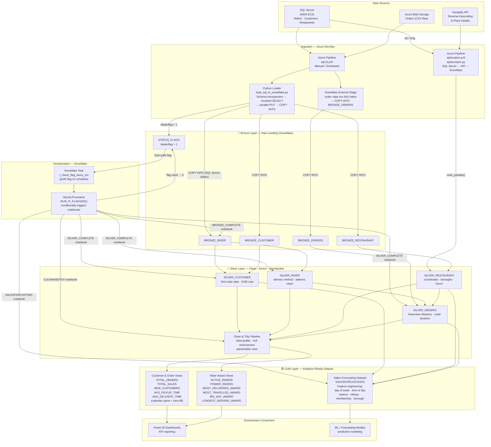

# Medallion Architecture — Snowflake Pipeline

Architecture diagram for the end-to-end Snowflake medallion data pipeline.  
Full project documentation: [`Projects/Snowflake_Medallion_Architecture_Pipeline`](../../Projects/Snowflake_Medallion_Architecture_Pipeline/README.md)

---

---

## Key Design Decisions

| Pattern | Implementation |
|---|---|
| Idempotent Bronze loads | `CREATE OR REPLACE TRANSIENT TABLE` — full refresh per run |
| Decoupled ingestion trigger | `STATUS_FLAGS` table with `datainflag` flag |
| Automated Snowflake processing | Snowflake Task → `RUN_IF_FLAGGED()` stored procedure → notebook chain |
| Enrichment separation | API enrichment pipeline runs independently, does not modify status flags |
| Data quality gate | Clean & Tidy stage between Silver and Gold enforces null handling and structural integrity |
| Calendar continuity | Gold views use date spine with zero-fill to ensure unbroken time-series for BI |
