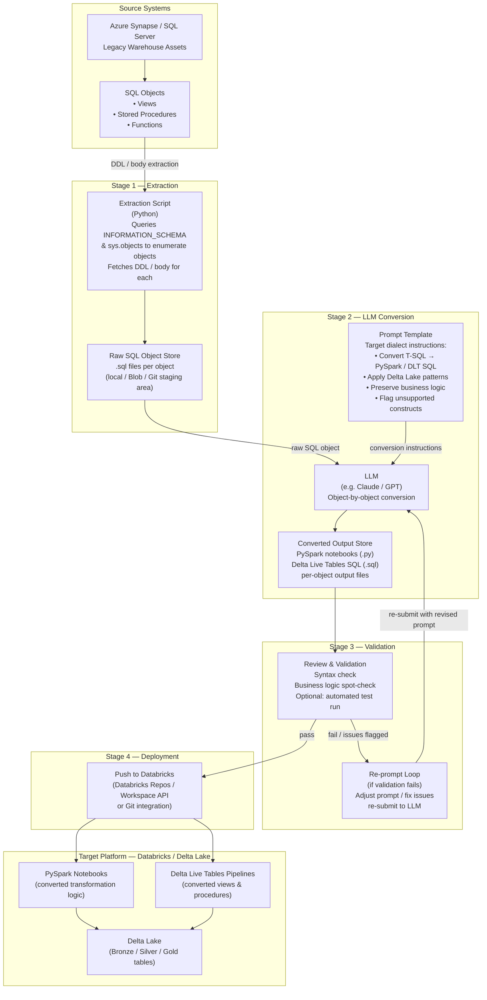

# Migration & LLM Conversion Pipeline

Architecture diagram for the AI-powered legacy SQL migration tool.  
This pipeline extracts SQL objects from a source data warehouse (Azure Synapse / SQL Server),
passes them to an LLM with a conversion prompt, and pushes the translated output to Databricks.

From CV: *"End-to-end migration of legacy warehouse assets from SQL Server and Azure Synapse into Databricks Delta Lake, engineering an AI-powered conversion tool to translate legacy SQL logic into PySpark and Delta Live Tables."*

---

---

## Pipeline Summary

| Stage | Purpose | Key Tools |
|---|---|---|
| Extraction | Enumerate and export all SQL objects from source warehouse | Python, `pyodbc`, `INFORMATION_SCHEMA`, `sys.sql_modules` |
| LLM Conversion | Translate T-SQL logic to PySpark / DLT SQL using a structured prompt | LLM API (Claude / GPT), prompt engineering |
| Validation | Check syntax correctness and preserve business logic | Manual review, optional automated syntax check |
| Deployment | Push converted artefacts to Databricks target environment | Databricks REST API / Repos / Git |

## Design Notes
- Each SQL object is converted independently, keeping prompts focused and outputs manageable.
- The prompt template carries target-dialect rules (Delta Lake patterns, PySpark equivalents, unsupported construct flagging) as a reusable system instruction.
- The re-prompt loop handles cases where the LLM output requires correction before deployment.
- Output files are saved before deployment so conversions can be reviewed, versioned, and rerun without re-extracting from source.
